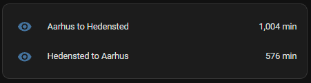
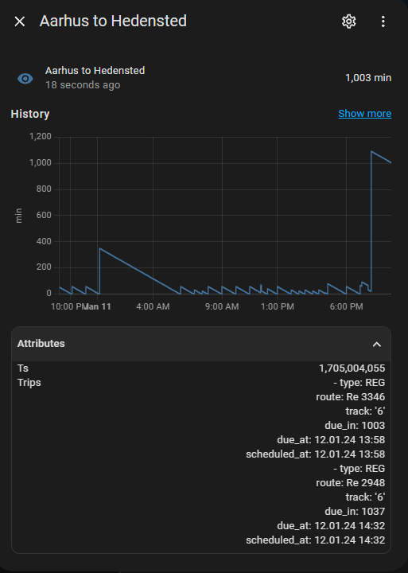
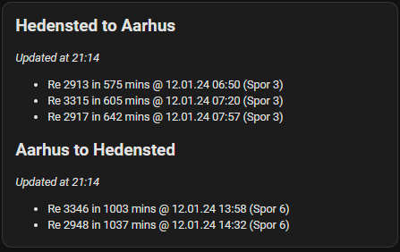

# Rejseplanen2Mqtt

This program periodically pulls trip information about Danish public transport from [Rejseplanen](https://rejseplanen.dk/) and publishes it to a MQTT broker, including Home Assistant discovery documents.

Features:

- Home Assistant Discovery Documents
- Metrics available on `:8080/metrics`
- Health check available on `:8080/health`
- Low resource usage thanks to C\#'s AoT

  - ~13 MB Image size (compressed)
  - 0.007 vCPU
  - 23 MB Memory

## How to run

1. Copy the `src/appsettings.json` to a new directory and modify it for your needs
2. Add a `docker-compose.yml` file to the directory

   ```yaml
   version: "3.8"
   services:
   rejseplanen2mqtt:
     image: jonasmh/rejseplanen2mqtt:latest
     ports:
       - 8080:8080 # Health and metrics
     volumes:
       - ./appsettings.json:/app/appsettings.json
   ```

3. Run `docker-compose up` in the directory
4. It will the periodically publish information about the trips to the MQTT broker

   Example information published (Topic: `rejseplanen/status/trips/aarhus_to_hedensted`):

   ```json
   {
     "value": 997,
     "attributes": {
       "ts": 1705004420,
       "trips": [
         {
           "type": "REG",
           "route": "Re 3346",
           "track": "6",
           "due_in": 997,
           "due_at": "12.01.24 13:58",
           "scheduled_at": "12.01.24 13:58"
         },
         {
           "type": "REG",
           "route": "Re 2948",
           "track": "6",
           "due_in": 1031,
           "due_at": "12.01.24 14:32",
           "scheduled_at": "12.01.24 14:32"
         }
       ]
     }
   }
   ```

> Note: Currently it only published direct routes

## Home Assistant Setup

The program published MQTT Discovery documents, so if a Home Assistant instance is connected to the same broker, Home Assistant should automatically pickup the entities.

The information is exposed as sensors counts down to the next departure for the given trip:



Each of the provided sensors also include attributes about the upcomming trips:



This information can be used to create a markdown dashboard:



```yaml
type: markdown
entities:
  - sensor.hedensted_to_aarhus # List of trips you want displayed
  - sensor.aarhus_to_hedensted
content: >-
  

  ## {{ state_attr(stop, 'friendly_name') }} 

  *Updated at {{ state_attr(stop, 'ts') | int | timestamp_custom("%H:%M") }}*

  

  - {{ nextTrip.route }} in {{ nextTrip.due_in }} mins @ {{ nextTrip.due_at }} 
  (Spor {{ nextTrip.track }})

   
```
